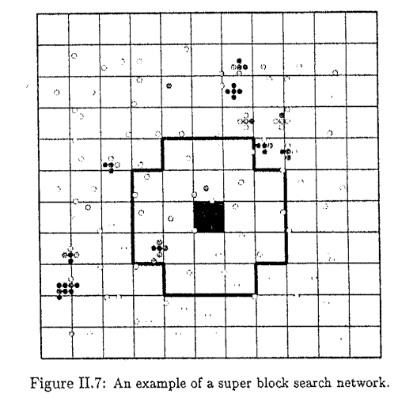

# Super Block Search

The super block search strategy is an eficient algorithm to be used in cases
where many points are to be estimated, using local data neighborhoods, with
the same set of original data. The algorithm calls for an initial
classification and ordering of the data according to a regular network of
parallelipedic blocks. This grid network is independent of the grid
network of points/blocks being estimated or simulated. Typically, the size
of the search network is much larger than the final estimation or simulation
grid node spacing.

When estimating any one point, only those data within nearby super
blocks have to be checked. A large number of data are thus quickly eliminated
because they have been classified in super blocks beyond the search limits.
This is illustrated in 2D on Figure II.7, where an 11 by 11 super block grid
network has been established over an area containing 140 data points. When
estimating a point anywhere within the dark gray super block, only those data
within the dark black line need be considered. Note that all search resolution
less than the size of a super block has been lost. Also note that the light
gray region is defined by the search ellipse (circle in this case) with its
center translated to every node to be estimated within the dark gray super
block. All super blocks intersected by the light gray region must be considered
to ensure that all nearby data are considered for estimahion of any node within
the central dark gray superblock.

The first task is to build a template of super blocks, centered at the super
block that contains the node being estimated. For example, the template
is the relative locations of all 21 blocks enclosed by the solid line on Figure
11.7. With this template, the nearby super blocks are easily established
when considering any new location.

